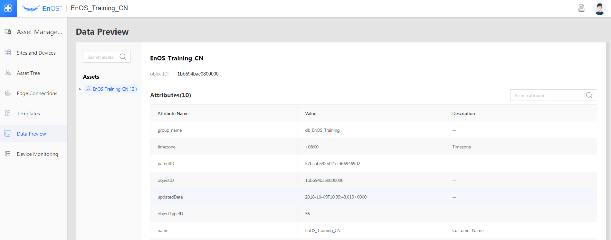

# Accessing EnOS

All functions of the EnOS Cloud are exposed as service APIs. Some of the functions are provided in the EnOS Console for you to access through a user-friendly graphical interface.

## EnOS APIs

EnOS provides APIs for developers to add, delete, modify, and retrieve resources such as users, assets, and applications, to facilitate development of applications. EnOS adopts a variety of authentication and authorization techniques to ensure secure access to the APIs.

To access the EnOS APIs, you'll need to register the application that will invoke the APIs on EnOS. The application can then access the APIs by presenting its application key and secret to be authenticated and authorized. For more information, see [Getting started with EnOS APIs](https://docs.envisioniot.com/docs/app-development/en/latest/enos_apis/getting_started_enos_apis.html) in the *Application Development* manual.

## EnOS Console

EnOS Console is a web-based graphic interface for you to interact with resources in the EnOS. The following figure shows a configuration interface in the EnOS Console.

The user interface is mainly comprised of 3 parts:

- Banner: Where you can click  to show or hide the navigation tree.
- Navigation tree: Where you can access the entries to all functions of EnOS cloud. You can also customize your view of navigation tree by adding your most frequently used functions into favorites for quick access.
- Configuration panel: Where you perform all configuration tasks around your data and resources on EnOS cloud.
